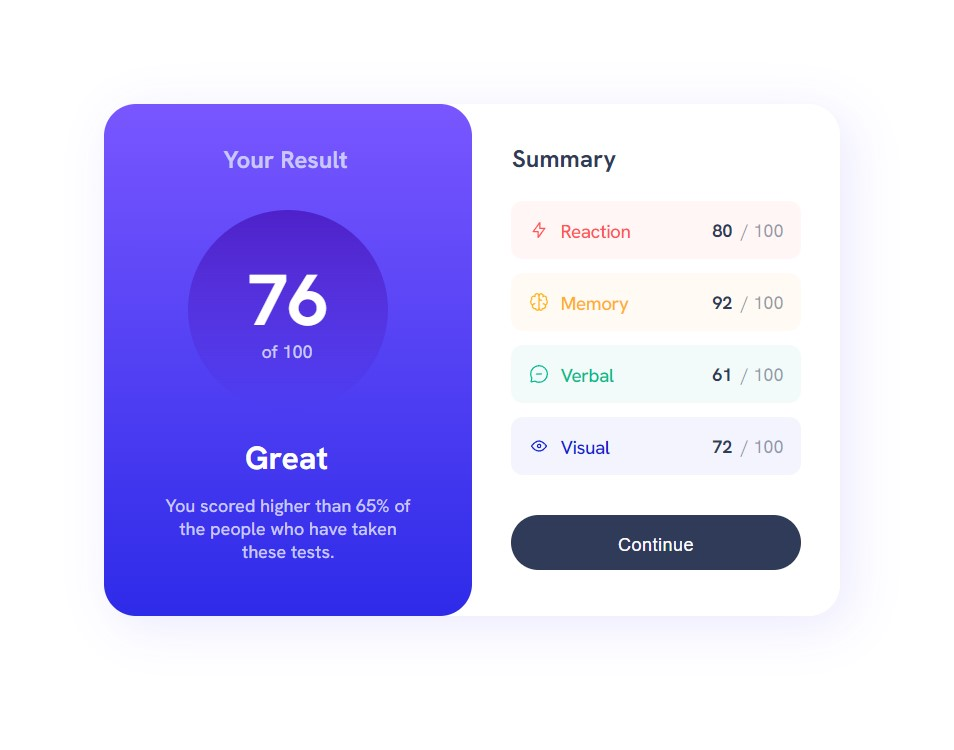

# Frontend Mentor - Results summary component solution

This is a solution to the [Results summary component challenge on Frontend Mentor](https://www.frontendmentor.io/challenges/results-summary-component-CE_K6s0maV). Frontend Mentor challenges help you improve your coding skills by building realistic projects. 

## Table of contents

- [Overview](#overview)
  - [The challenge](#the-challenge)
  - [Screenshot](#screenshot)
  - [Links](#links)
- [Author](#author)

## Overview

### The challenge

Users should be able to:

- View the optimal layout for the interface depending on their device's screen size
- See hover and focus states for all interactive elements on the page

### Screenshot

### Links

- Solution URL: [isildurrr1/result-summary-component](https://github.com/isildurrr1/result-summary-component)
- Live Site URL: [gh-pages](https://isildurrr1.github.io/result-summary-component/)

## Author

- Website - [@isildurrr1](https://github.com/isildurrr1)
- Frontend Mentor - [@isildurrr1](https://www.frontendmentor.io/profile/isildurrr1)
- linkedIn - [@r0mashev](https://www.linkedin.com/in/r0mashev/)

